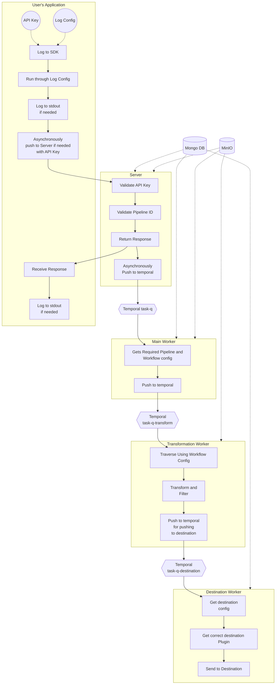

High Level Architecture Diagram

```mermaid
flowchart TD
    %% Data Stores
    MongoDB[(Mongo DB)]
    MinIO[(MinIO)]
    %% User Application Section
    subgraph User["User's Application"]
        APIKey((API Key))
        LogConfig((Log Config))
        LogToSDK[Log to SDK]
        RunLogConfig[Run through Log Config]
        StdoutSDK[Log to stdout<br/>if needed]
        AsyncPushServer[Asynchronously<br/>push to Server if needed<br/>with API Key]
        ReceiveResponse[Receive Response]
        StdoutResponse[Log to stdout<br/>if needed]
    end

    %% Server Section
    subgraph Server
        ValidateAPIKey[Validate API Key]
        ValidatePipelineID[Validate Pipeline ID]
        ReturnResponse[Return Response]
        AsyncPushTemporal[Asynchronously<br/>Push to temporal]
    end

    %% Temporal & Workers
    TemporalTaskQ{{Temporal task-q}}

    %% Main Worker Section
    subgraph MainWorker["Main Worker"]
        GetPipelineConfig[Gets Required Pipeline and<br/>Workflow config]
        PushToTemporal[Push to temporal]
    end

    TemporalTransform{{Temporal<br/>task-q-transform}}

    %% Transformation Worker Section
    subgraph TransformationWorker["Transformation Worker"]
        TraverseWorkflow[Traverse Using Workflow Config]
        TransformFilter[Transform and<br/>Filter]
        PushToDestQueue[Push to temporal<br/>for pushing<br/>to destination]
    end

    TemporalDestination{{Temporal<br/>task-q-destination}}

    %% Destination Worker Section
    subgraph DestinationWorker["Destination Worker"]
        GetDestConfig[Get destination<br/>config]
        GetDestPlugin[Get correct destination Plugin]
        SendToDestination[Send to Destination]
    end

    %% Flows
    APIKey -.-> LogToSDK
    LogConfig -.-> LogToSDK
    LogToSDK --> RunLogConfig
    RunLogConfig --> StdoutSDK
    StdoutSDK --> AsyncPushServer
    AsyncPushServer --> ValidateAPIKey
    ValidateAPIKey --> ValidatePipelineID
    ValidatePipelineID --> ReturnResponse
    ReturnResponse --> AsyncPushTemporal
    ReturnResponse --> ReceiveResponse
    ReceiveResponse --> StdoutResponse

    AsyncPushTemporal --> TemporalTaskQ
    TemporalTaskQ --> GetPipelineConfig
    GetPipelineConfig --> PushToTemporal
    PushToTemporal --> TemporalTransform
    TemporalTransform --> TraverseWorkflow
    TraverseWorkflow --> TransformFilter
    TransformFilter --> PushToDestQueue
    PushToDestQueue --> TemporalDestination
    TemporalDestination --> GetDestConfig
    GetDestConfig --> GetDestPlugin
    GetDestPlugin --> SendToDestination

    %% Database connections (dashed)
    MongoDB -.-> Server
    MinIO -.-> Server
    MongoDB -.-> MainWorker
    MongoDB -.-> DestinationWorker
    MinIO -.-> MainWorker
    MinIO -.-> TransformationWorker
```

