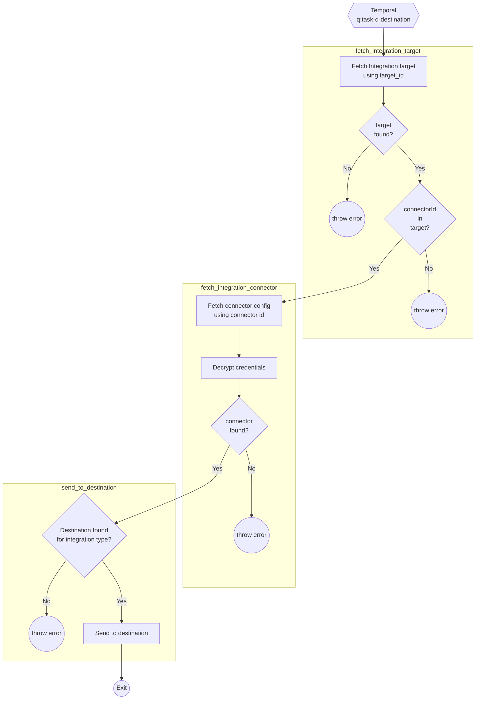

Destination Temporal Worker Flow

```mermaid
graph TB
    Temporal{{Temporal<br/>q:task-q-destination}}
    
    %% fetch_integration_target Activity
    subgraph FetchTargetActivity["fetch_integration_target"]
        FetchTarget[Fetch Integration target<br/>using target_id]
        TargetFound{target<br/>found?}
        ThrowError1((throw error))
        ConnectorCheck{connectorId<br/>in<br/>target?}
        ThrowError2((throw error))
    end
    
    %% fetch_integration_connector Activity
    subgraph FetchConnectorActivity["fetch_integration_connector"]
        FetchConnector[Fetch connector config<br/>using connector id]
        DecryptCreds[Decrypt credentials]
        ConnectorFound{connector<br/>found?}
        ThrowError3((throw error))
    end
    
    %% send_to_destination Activity
    subgraph SendDestinationActivity["send_to_destination"]
        DestinationCheck{Destination found<br/>for integration type?}
        ThrowError4((throw error))
        SendToDestination[Send to destination]
    end
    
    Exit((Exit))
    
    %% Flow connections
    Temporal --> FetchTarget
    FetchTarget --> TargetFound
    TargetFound -->|No| ThrowError1
    TargetFound -->|Yes| ConnectorCheck
    ConnectorCheck -->|No| ThrowError2
    ConnectorCheck -->|Yes| FetchConnector
    
    FetchConnector --> DecryptCreds
    DecryptCreds --> ConnectorFound
    ConnectorFound -->|No| ThrowError3
    ConnectorFound -->|Yes| DestinationCheck
    
    DestinationCheck -->|No| ThrowError4
    DestinationCheck -->|Yes| SendToDestination
    SendToDestination --> Exit
```

