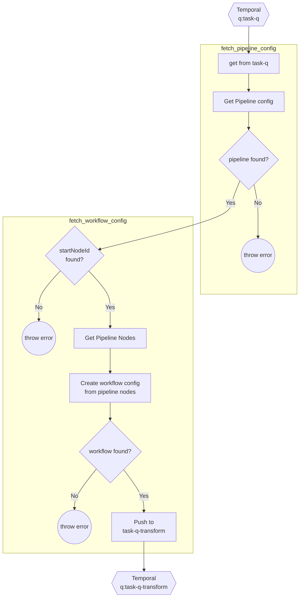

Main Temporal Worker Flow

```mermaid
graph TB
    TemporalInput{{Temporal<br/>q:task-q}}
    TemporalOutput{{Temporal<br/>q:task-q-transform}}
    %% fetch_pipeline_config Activity
    subgraph FetchPipelineActivity["fetch_pipeline_config"]
        GetFromTaskQ[get from task-q]
        GetPipelineConfig[Get Pipeline config]
        PipelineFound{pipeline found?}
        ThrowError1((throw error))
    end
    
    %% fetch_workflow_config Activity
    subgraph FetchWorkflowActivity["fetch_workflow_config"]
        StartNodeCheck{startNodeId<br/>found?}
        ThrowError2((throw error))
        GetPipelineNodes[Get Pipeline Nodes]
        CreateWorkflowConfig[Create workflow config<br/>from pipeline nodes]
        WorkflowFound{workflow found?}
        ThrowError3((throw error))
        PushToTransform[Push to<br/>task-q-transform]
    end
    
    %% Flow connections
    TemporalInput --> GetFromTaskQ
    GetFromTaskQ --> GetPipelineConfig
    GetPipelineConfig --> PipelineFound
    PipelineFound -->|No| ThrowError1
    PipelineFound -->|Yes| StartNodeCheck
    StartNodeCheck -->|No| ThrowError2
    StartNodeCheck -->|Yes| GetPipelineNodes
    GetPipelineNodes --> CreateWorkflowConfig
    CreateWorkflowConfig --> WorkflowFound
    WorkflowFound -->|No| ThrowError3
    WorkflowFound -->|Yes| PushToTransform
    PushToTransform --> TemporalOutput
```

