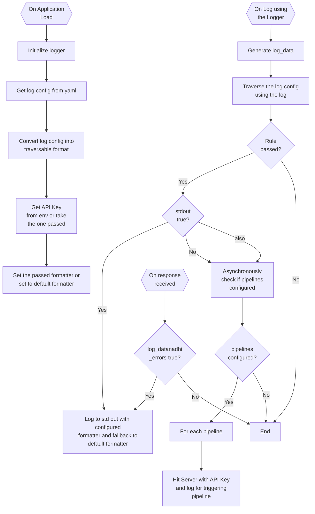

Diagram of Flow in SDK

```mermaid
graph TB

%% Initialization Phase
    Start{{On Application<br/>Load}} --> InitLogger[Initialize logger]
    InitLogger --> GetConfig[Get log config from yaml]
    GetConfig --> ConvertConfig[Convert log config into<br/>traversable format]
    ConvertConfig --> GetAPIKey[Get API Key<br/>from env or take<br/>the one passed]
    GetAPIKey --> SetFormatter[Set the passed formatter or<br/>set to default formatter]
    
    %% Logging Phase
    LogEvent{{On Log using<br/>the Logger}} --> GenData[Generate log_data]
    GenData --> TraverseConfig[Traverse the log config<br/>using the log]
    TraverseConfig --> RulePassed{Rule<br/>passed?}
    
    RulePassed -->|Yes| StdoutCheck{stdout<br/>true?}
    RulePassed -->|No| End[End]
    
    StdoutCheck -->|Yes| LogStdout[Log to std out with configured<br/>formatter and fallback to<br/>default formatter]
    StdoutCheck -->|No| CheckPipelines[Asynchronously<br/>check if pipelines<br/>configured]
    
    CheckPipelines --> PipelinesConfigured{pipelines<br/>configured?}
    
    PipelinesConfigured -->|Yes| ForEach[For each pipeline]
    PipelinesConfigured -->|No| End
    
    ForEach --> HitServer[Hit Server with API Key<br/>and log for triggering<br/>pipeline]
    
    %% Response Handling
    Response{{On response<br/>received}} --> ErrorCheck{log_datanadhi<br/>_errors true?}
    ErrorCheck -->|Yes| LogStdout
    ErrorCheck -->|No| End
    
    %% Also log to stdout when both conditions met
    StdoutCheck -->|also| CheckPipelines

```

