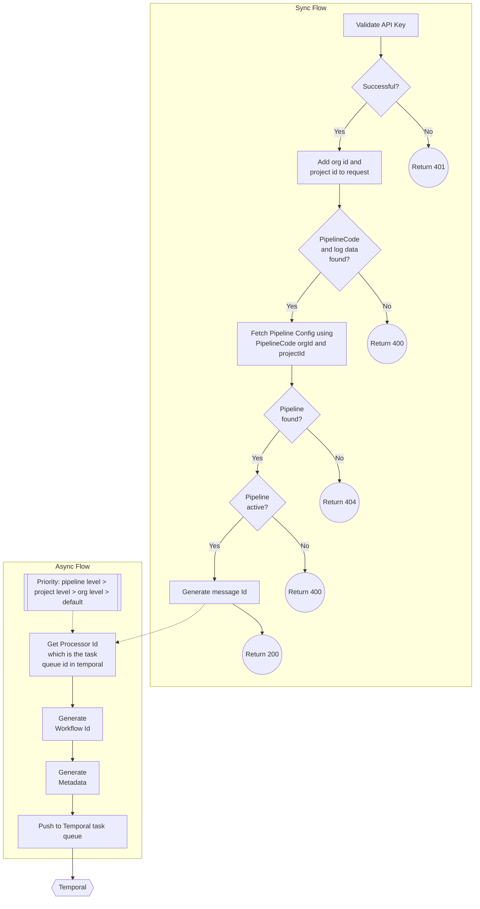

Server Logic Diagram

```mermaid
graph TB
    %% Sync Flow - Validation and Response
    subgraph SyncFlow["Sync Flow"]
        ValidateAPI[Validate API Key]
        APISuccess{Successful?}
        AddOrgProj[Add org id and<br/>project id to request]
        CheckPipelineCode{PipelineCode<br/>and log data<br/>found?}
        FetchPipeline[Fetch Pipeline Config using<br/>PipelineCode orgId and projectId]
        PipelineFound{Pipeline<br/>found?}
        PipelineActive{Pipeline<br/>active?}
        GenMessageID[Generate message Id]
        Return401((Return 401))
        Return400a((Return 400))
        Return400b((Return 400))
        Return404((Return 404))
        Return200((Return 200))
    end
    
    %% Async Flow - Message Processing
    subgraph AsyncFlow["Async Flow"]
        GetProcessorID[Get Processor Id<br/>which is the task<br/>queue id in temporal]
        GenWorkflowID[Generate<br/>Workflow Id]
        GenMetadata[Generate<br/>Metadata]
        PushTemporal[Push to Temporal task queue]
        ProcessorNote[["Priority: pipeline level > project level > org level > default"]]
    end
    
    %% Temporal (outside subgraphs)
    TemporalQueue{{Temporal}}
    
    %% Sync Flow connections
    ValidateAPI --> APISuccess
    APISuccess -->|Yes| AddOrgProj
    APISuccess -->|No| Return401
    AddOrgProj --> CheckPipelineCode
    CheckPipelineCode -->|No| Return400a
    CheckPipelineCode -->|Yes| FetchPipeline
    FetchPipeline --> PipelineFound
    PipelineFound -->|No| Return404
    PipelineFound -->|Yes| PipelineActive
    PipelineActive -->|No| Return400b
    PipelineActive -->|Yes| GenMessageID
    GenMessageID --> Return200
    
    %% Async Flow connections
    GenMessageID -.-> GetProcessorID
    ProcessorNote -.-> GetProcessorID
    GetProcessorID --> GenWorkflowID
    GenWorkflowID --> GenMetadata
    GenMetadata --> PushTemporal
    PushTemporal --> TemporalQueue
```

