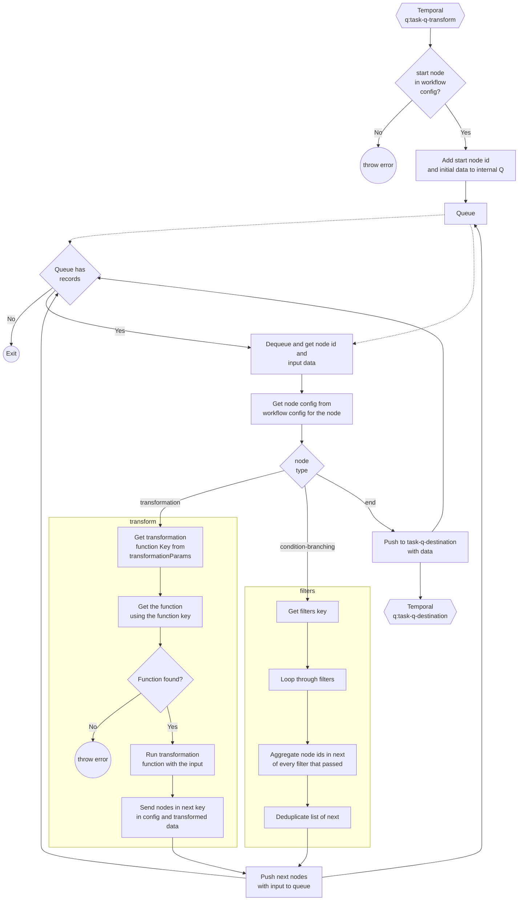

Transformation Temporal Worker Flow

```mermaid
graph TB
    TemporalInput{{Temporal<br/>q:task-q-transform}}
    TemporalOutput{{Temporal<br/>q:task-q-destination}}
    
    StartNodeCheck{start node<br/>in workflow<br/>config?}
    ThrowError1((throw error))
    AddToQueue[Add start node id<br/>and initial data to internal Q]
    Queue[Queue]
    
    QueueCheck{Queue has<br/>records}
    Exit((Exit))
    
    Dequeue[Dequeue and get node id and<br/>input data]
    GetNodeConfig[Get node config from<br/>workflow config for the node]
    
    NodeType{node<br/>type}
    
    %% Transformation Flow
    subgraph TransformActivity["transform"]
        GetTransformKey[Get transformation<br/>function Key from<br/>transformationParams]
        GetFunction[Get the function<br/>using the function key]
        FunctionFound{Function found?}
        ThrowError2((throw error))
        RunTransform[Run transformation<br/>function with the input]
        SendNextTransform[Send nodes in next key<br/>in config and transformed data]
    end
    
    %% Condition-Branching Flow
    subgraph FiltersActivity["filters"]
        GetFilters[Get filters key]
        LoopFilters[Loop through filters]
        AggregateNext[Aggregate node ids in next<br/>of every filter that passed]
        Deduplicate[Deduplicate list of next]
    end
    
    PushToQueue[Push next nodes<br/>with input to queue]
    PushToDestination[Push to task-q-destination<br/>with data]
    
    %% Main Flow
    TemporalInput --> StartNodeCheck
    StartNodeCheck -->|No| ThrowError1
    StartNodeCheck -->|Yes| AddToQueue
    AddToQueue --> Queue
    Queue -.-> QueueCheck
    Queue -.-> Dequeue
    
    QueueCheck -->|No| Exit
    QueueCheck -->|Yes| Dequeue
    
    Dequeue --> GetNodeConfig
    GetNodeConfig --> NodeType
    
    %% Node Type Routing
    NodeType -->|transformation| GetTransformKey
    NodeType -->|condition-branching| GetFilters
    NodeType -->|end| PushToDestination
    
    %% Transformation Path
    GetTransformKey --> GetFunction
    GetFunction --> FunctionFound
    FunctionFound -->|No| ThrowError2
    FunctionFound -->|Yes| RunTransform
    RunTransform --> SendNextTransform
    SendNextTransform --> PushToQueue
    
    %% Condition-Branching Path
    GetFilters --> LoopFilters
    LoopFilters --> AggregateNext
    AggregateNext --> Deduplicate
    Deduplicate --> PushToQueue
    
    %% Loop back
    PushToQueue --> Queue
    PushToQueue --> QueueCheck
    
    %% End Path
    PushToDestination --> QueueCheck
    PushToDestination --> TemporalOutput
```

